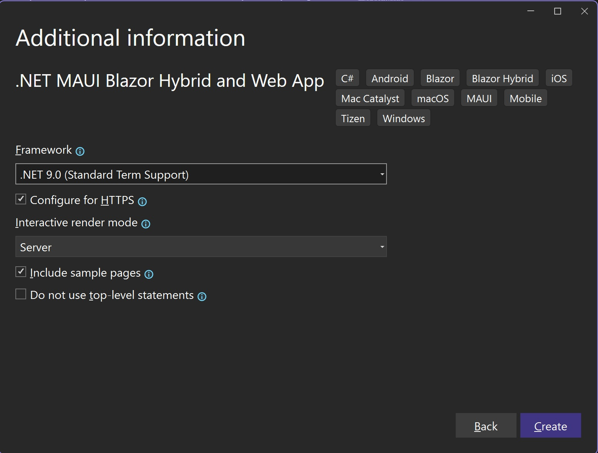
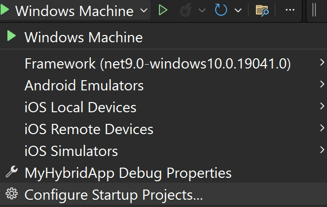
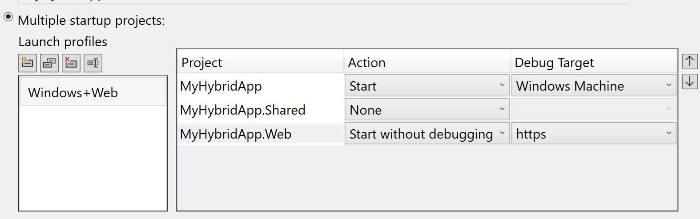
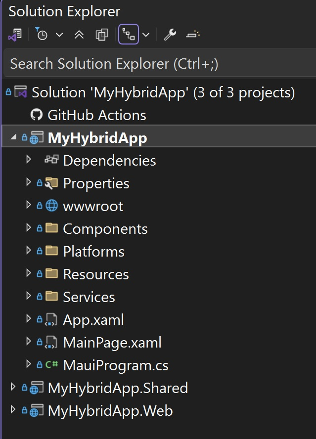
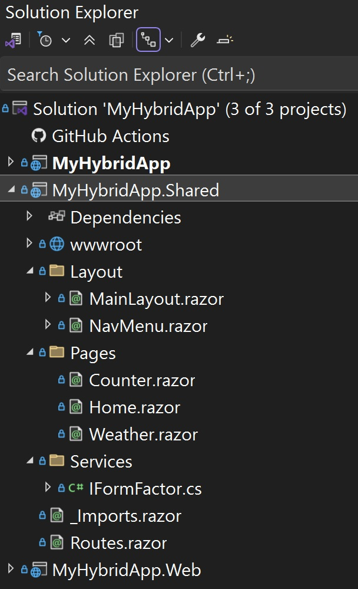
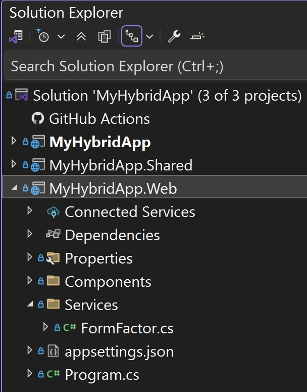

## 1. Overview of .NET MAUI and Blazor Hybrid 

### Goal
Understand the structure and purpose of the .NET MAUI Blazor Hybrid and Web template. Learn how it enables shared UI components between a Blazor Web App and a .NET MAUI app, and how to create a new project using the template.

### What is .NET MAUI?
.NET Multi-platform App UI (MAUI) is a framework for building cross-platform applications with a single codebase. It supports Android, iOS, macOS, and Windows, enabling developers to create native apps using C# and .NET. It provides an abstraction layer over the native platform controls and device functionality so that you can write code once and target multiple platforms. 

### What is Blazor?
Blazor is a web framework that allows developers to build interactive web applications using C# and Razor syntax. It eliminates the need for JavaScript by enabling developers to write client-side logic in C#. Blazor supports multiple hosting models:

- **Blazor Server**: Runs the application on the server, with UI updates sent to the client over a SignalR connection.
- **Blazor WebAssembly**: Runs the application directly in the browser using WebAssembly, downloading the .NET runtime and app code to the client.
- **Blazor Hybrid**: Embeds Blazor components into native applications using frameworks like .NET MAUI. Unlike other Blazor modes, Blazor Hybrid apps:
  - Do **not** use WebAssembly.
  - Do **not** require a server for hosting.
  - Run .NET logic directly on the device using the .NET runtime while the UI is rendered via the platform WebView.

### What is Blazor Hybrid?
Blazor Hybrid allows you to embed Blazor components into native apps using .NET MAUI. This approach combines the strengths of web and native development, enabling code reuse across web and native platforms and access to native device features. Blazor Hybrid apps leverage the **BlazorWebView** control, which renders Razor components inside a native WebView, while running .NET code directly on the device.

### Create the project
1. [] **Open Visual Studio**
   
Launch **Visual Studio** and select **Create a new project** from the start screen. This is the starting point for creating a new solution.

2. [] **Choose the Template**

Select the **.NET MAUI Blazor Hybrid and Web App** template. This template is specifically designed to create a solution with multiple projects: a shared Razor Class Library (RCL), a Blazor Web App, and a .NET MAUI Blazor Hybrid App. These projects allow you to share UI components and logic across platforms.

3. [] **Name the Project**

Enter `MyHybridApp` as the project name and click **Next**. 

4. [] **Configure the Project**

- Set the **Framework** to **.NET 9.0**. This ensures the project uses the latest version of .NET, providing access to the newest features and improvements.
- Check **Configure for HTTPS** to enable secure communication between the app and any external services.
- Set the **Interactive Render Mode** to **Server**. This mode allows the Blazor Web App to use interactive server-side rendering.
- Check **Include sample pages** to generate example components and pages that can serve as a starting point for your app.
- **Unselect** the option for "Do not use top-level statements." This ensures the project uses the modern C# syntax, which simplifies the code structure.
- Click **Create**



This will generate a solution with the following structure:
- **MyHybridApp**: A .NET MAUI Blazor Hybrid App project.
- **MyHybridApp.Shared**: Contains shared Razor components and services.
- **MyHybridApp.Web**: A Blazor Web App project.


### Run the app

1. [] Make sure the project has restored all the NuGet packages. From the Build menu, select **Build Solution** `Ctrl+Shift+B` to build all of the projects for all of the platforms. 

2. [] To make it easier to run the entire solution when debugging, drop down the Debug target menu and select **Configure Startup Projects...**



3. [] Select **Multiple Startup Projects** and configure the launch profile to **Start** the **MyHybridApp** with the **Debug Target** set to _Windows Machine_ and set the **MyHybridApp.Web** to **Start without debugging** with the **Debug Target** set to _https_. 

4. [] Name the Launch profile **Windows+Web** then Click **OK**.



5. [] Make sure the launch profile is selected and then click **Start** `F5` to start debugging. A web browser and a Windows app will launch. Notice that the functionality of the apps is exactly the same. They both share all of their UI with the shared Razor Class Library **MyHybridApp.Shared**. The only difference is the Home page displays a different message depending on what device you are on. 

### Tour of the code
1. [] **MyHybridApp .NET MAUI client**

- Explore the project structure in the Solution Explorer. This project is a blend of Blazor and .NET MAUI source code. 

    

    - **wwwroot** is where the static web assets are located like application-wide CSS and **index.html** file that is used as the root of the BlazorWebView.
    - **Platforms** folder is where any device-specific code that you may need to configure belongs.
    - **Resources** are where all the .NET MAUI static assets that end up on the devices belong like splash screens and images or any other raw files you need to put on the device. 

- Open up this project's **.csproj** file by double-clicking on the project name in the Solution Explorer. Notice that the project is multi-targeted for Android, iOS, MacCatalyst, and Windows (Windows will only build if you are on Windows):

```xml
<TargetFrameworks>net9.0-android;net9.0-ios;net9.0-maccatalyst</TargetFrameworks>
<TargetFrameworks Condition="$([MSBuild]::IsOSPlatform('windows'))">$(TargetFrameworks);net9.0-windows10.0.19041.0</TargetFrameworks>
```

- Open the **MainPage.xaml** and note the **BlazorWebView** MAUI control. This template sets the application to be a single WebView and all the UI comes from Blazor. However, you could add more native controls to the .NET MAUI client as necessary with XAML here. 

```xml
<BlazorWebView x:Name="blazorWebView" HostPage="wwwroot/index.html">
    <BlazorWebView.RootComponents>
        <RootComponent Selector="#app" ComponentType="{x:Type shared:Routes}" />
    </BlazorWebView.RootComponents>
</BlazorWebView>
```

 - Open up the **MauiProgram.cs**, the starting point that configures the builder that creates the **MauiApp**. This is where your app services are created. Services used by the shared UI may need to be specific implementations depending on where it's running. In that case, we can use the interface injection pattern. This template provides an example called **FormFactor** that returns information about the device the app is running on. 

```csharp
builder.Services.AddSingleton<IFormFactor, FormFactor>();
```
 - Open the **Services\FormFactor.cs** in the MAUI client. Here it uses the MAUI abstraction layer to return information about the device. This same code handles the 4 platforms that the MAUI client targets using the [`Microsoft.Maui.Devices`](https://learn.microsoft.com/dotnet/api/microsoft.maui.devices) namespace. 

```csharp
public class FormFactor : IFormFactor
{
    public string GetFormFactor()
    {
        return DeviceInfo.Idiom.ToString();
    }

    public string GetPlatform()
    {
        return DeviceInfo.Platform.ToString() + " - " + DeviceInfo.VersionString;
    }
}
```    

2. [] **MyHybridApp.Shared Razor Class Library**
- Expand the **MyHybridApp.Shared** project structure in Solution Explorer. Notice the **Pages** and **Layout** that are shared by the .NET MAUI and Blazor Web apps. 



- Open the **Services** folder and you will see the definition of the **IFormFactor** interface here. 

- Open the **Home.razor** page and notice the code at the top of the file that injects the interface so that the implementations can be used on the page. 
```csharp
@page "/"
@using MyHybridApp.Shared.Services
@inject IFormFactor FormFactor
```

3. [] **MyHybridApp.Web Blazor Web App**
- Expand the **MyHybridApp.Web** project structure in Solution Explorer.



- Open up the **Services\FormFactor.cs** and notice the implementation here is specific for the server app, returning "Web" for the form factor. 
```csharp
    public class FormFactor : IFormFactor
    {
        public string GetFormFactor()
        {
            return "Web";
        }

        public string GetPlatform()
        {
            return Environment.OSVersion.ToString();
        }
    }
```
- Open the **Program.cs** which configures the builder for the web app. Here the same pattern is used for injecting the server implementation of **FormFactor**.
```csharp
builder.Services.AddSingleton<IFormFactor, FormFactor>();
```
### Check-in
At the end of this section, you should have an app with the basic template code properly restored and running as provided in the [1-Overview](https://github.com/dotnet-presentations/build-2025-lab305/tree/main/1-Overview/) folder.
