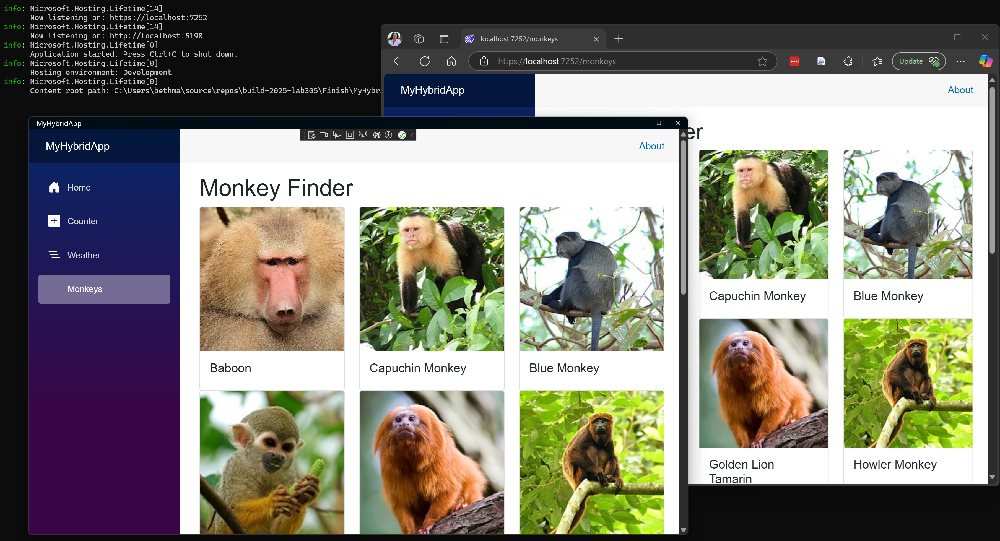
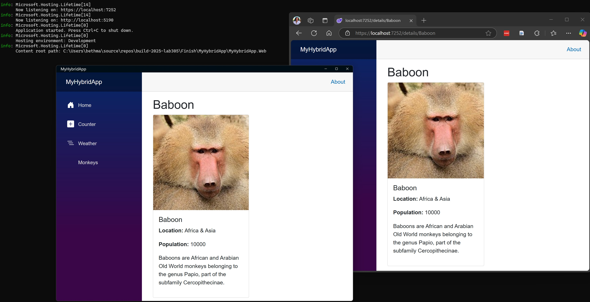

## 3. Building UI and Adding Navigation

### Goal
Build a UI that displays a list of monkeys and add that page to the app's navigation menu. When a monkey is selected in the list, display the monkey details. 

### Steps
1. [] **Create the Monkeys Page**

Create a new Razor page **Pages\Monkeys.razor** in the **MyHybridApp.Shared** project. This page will fetch and display a list of monkeys using the **IMonkeyService**. It will include a loading spinner while the data is being fetched and display each monkey's name and image in a card layout.

```razor
@using MyHybridApp.Shared.Services
@using MyHybridApp.Shared.Models
@page "/monkeys"
@inject IMonkeyService MonkeyService

<h1>Monkey Finder</h1>

@if (monkeys == null)
{
    <div class="text-center">
        <div class="spinner-border text-primary" role="status">
            <span class="visually-hidden">Loading...</span>
        </div>
    </div>
}
else
{
    <div class="row">
        @foreach (var monkey in monkeys)
        {
            <div class="col-md-4">
                <div class="card">
                    
                    <div class="card-body">
                        <h5 class="card-title">@monkey.Name</h5>
                    </div>
                </div>
            </div>
        }
    </div>
}

@code {
    private List<Monkey>? monkeys;

    protected override async Task OnInitializedAsync()
    {
        monkeys = await MonkeyService.GetMonkeysAsync();
    }
}
```

2. [] **Add the Monkeys Page to the Navigation Menu**

To make the **Monkeys** page accessible, add a navigation link to the **Layout\NavMenu.razor** file in the **MyHybridApp.Shared** project. This link will allow users to navigate to the **/monkeys** route.

```razor
<div class="nav-item px-3">
    <NavLink class="nav-link" href="monkeys">
        <span class="bi bi-list-ul-nav-menu" aria-hidden="true"></span> Monkeys
    </NavLink>
</div>
```

3. [] **Run the Solution**

Make sure the monkey data is loading. Build and Debug `F5` the solution. Navigate to the **Monkeys** page by selecting the link in the menu. Make sure both the Windows app and the Web app work as expected. 



4. [] **Create the Details Page**

Add a new Razor component named **DetailsPage.razor** in the **MyHybridApp.Shared** project. This page will display detailed information about a selected monkey. The route for this page will include a **name** parameter to identify the selected monkey.

```razor
@using MyHybridApp.Shared.Services
@using MyHybridApp.Shared.Models
@page "/details/{name}"
@inject IMonkeyService MonkeyService

<h1>@monkey?.Name</h1>

@if (monkey != null)
{
    <div class="col-lg-6">
        <div class="card">
            
            <div class="card-body">
                <h5 class="card-title">@monkey.Name</h5>
                <p><strong>Location:</strong> @monkey.Location</p>
                <p><strong>Population:</strong> @monkey.Population</p>
                <p>@monkey.Details</p>
            </div>
        </div>
    </div>
}

@code {
    [Parameter] public string Name { get; set; } = string.Empty;
    private Monkey? monkey;

    protected override async Task OnParametersSetAsync()
    {
        monkey = await Task.FromResult(MonkeyService.GetMonkeyByName(Name));
    }
}
```

5. [] **Update the Monkeys Page for Navigation**

Modify the **Monkeys.razor** file to add a clickable link to each monkey card under the `<div class="card-body">` section. This link will navigate to the details page for the selected monkey.

```razor
<a href="/details/@monkey.Name" class="stretched-link"></a>
```

6. [] **Run the Solution**

Make sure the monkey detail data is loading. Build and Debug `F5` the solution. Select a monkey to pull up the details page. Make sure both the Windows app and the Web app work as expected. 



### Check-in

At the end of this section, you should have an app with all the functionality working and running as provided in the [3-UI](../3-UI/) folder.
