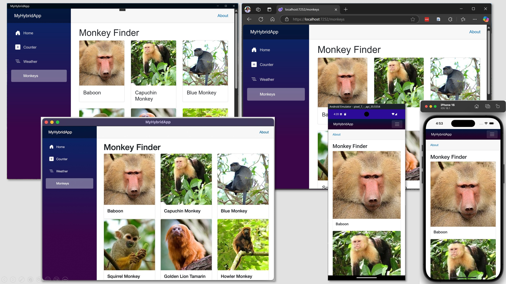

# Build 2025 Lab 305
## Build Multi-platform Hybrid Apps with Blazor & .NET MAUI

In this lab, you'll build a hybrid mobile, desktop and web application using the [.NET MAUI Blazor Hybrid and Web](https://learn.microsoft.com/aspnet/core/blazor/hybrid/tutorials/maui-blazor-web-app?view=aspnetcore-9.0#net-maui-blazor-hybrid-and-web-app-solution-template) template. This template combines a Blazor Web app and a .NET MAUI app, sharing UI components through a Razor Class Library (RCL) that can be deployed to Android, iOS, macOS, Windows and the web. By the end of this 75-minute workshop, you'll have a functional app that displays data, navigates between pages, and uses platform-specific features.

## Agenda

Follow these sections in sequence to build the solution for this lab. 

1. [Overview of .NET MAUI and Blazor Hybrid](/1-Overview/README.md)
2. [Fetching Data](/2-Data/README.md)
3. [Building UI and Adding Navigation](/3-UI/README.md)
4. [Using Platform Features](/4-Platform/README.md)

At the end of this lab, you will build an app that looks like this across Android, iOS, macOS, Windows and web platforms.

## More resources
- [Learn: What is .NET MAUI?](https://learn.microsoft.com/dotnet/maui/what-is-maui?view=net-maui-9.0)
- [Learn: Overview of hybrid apps](https://learn.microsoft.com/dotnet/maui/hybrid-apps/?view=net-maui-9.0)
- [Learn: .NET MAUI Platform features](https://learn.microsoft.com/dotnet/maui/platform-integration/?view=net-maui-9.0)
- [Tutorial: Build a .NET MAUI Blazor Hybrid app with a Blazor Web App](https://learn.microsoft.com/aspnet/core/blazor/hybrid/tutorials/maui-blazor-web-app?view=aspnetcore-9.0&viewFallbackFrom=net-maui-9.0&toc=%2Fdotnet%2Fmaui%2Ftoc.json&bc=%2Fdotnet%2Fmaui%2Fbreadcrumb%2Ftoc.json)
- [Tutorial: Build a .NET MAUI Blazor Hybrid and Web App with ASP.NET Core Identity](https://learn.microsoft.com/aspnet/core/blazor/hybrid/security/maui-blazor-web-identity?toc=%2Fdotnet%2Fmaui%2Ftoc.json&bc=%2Fdotnet%2Fmaui%2Fbreadcrumb%2Ftoc.json&view=aspnetcore-9.0)
- [Learn: Publish Blazor Hybrid apps](https://learn.microsoft.com/aspnet/core/blazor/hybrid/publish/?toc=%2Fdotnet%2Fmaui%2Ftoc.json&bc=%2Fdotnet%2Fmaui%2Fbreadcrumb%2Ftoc.json&view=aspnetcore-9.0)
